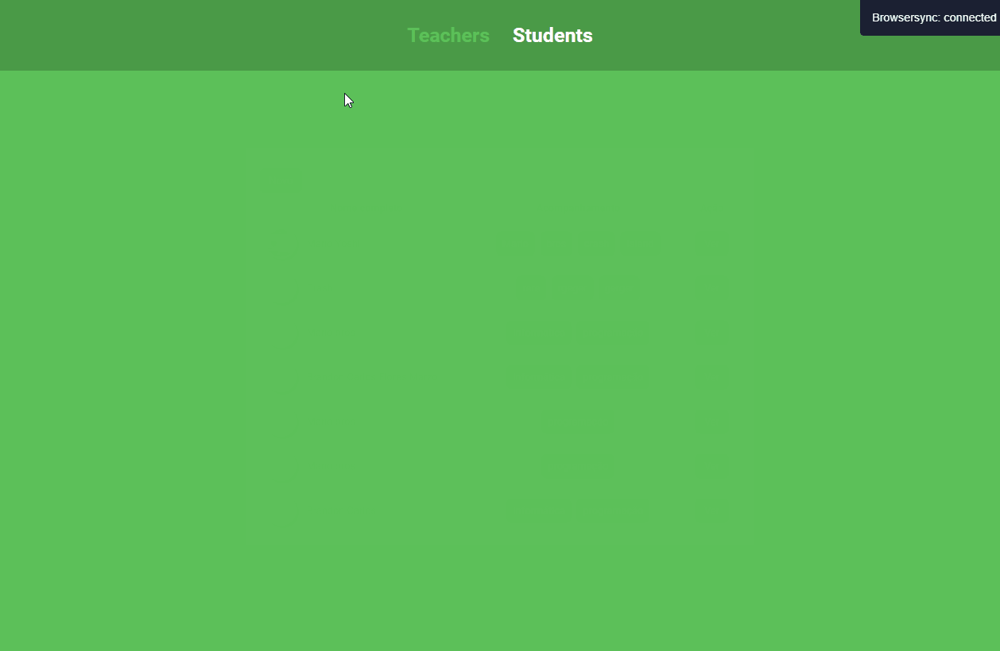

    <h1>Cadastro de professores e alunos</h1>

    

 

Esta aplicação consiste em poder cadastrar Professores e alunos com suas devidas informações.

#### Tecnologias usadas
- [x] HTML
- [x] CSS
- [x] Javascript
- [x] Template Engine - Nunjucks
- [x] Node.JS
- [x] Express
- [x] Arquitetura MVC
- [x] CSS Animation's

🚀 O próximo passo é integrar está aplicação com o banco de dados, quanto ao banco de dados usarei o PostgreSQL.

Feito com ❤ por Brandon Carlos 🚀

